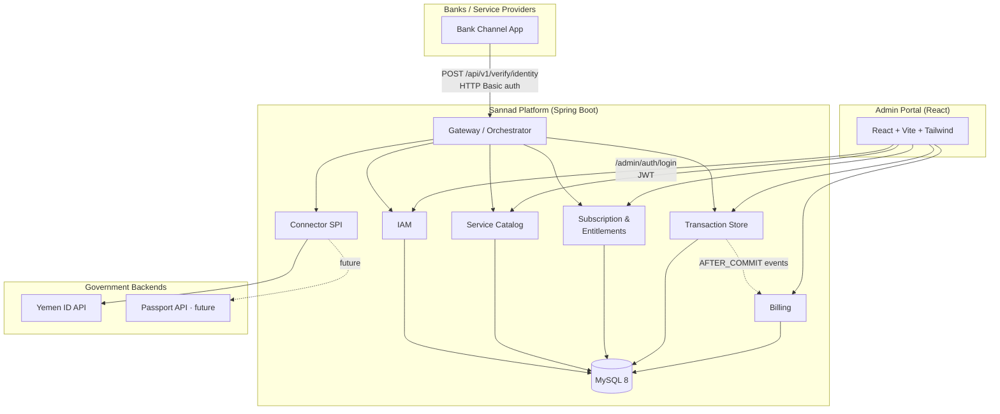
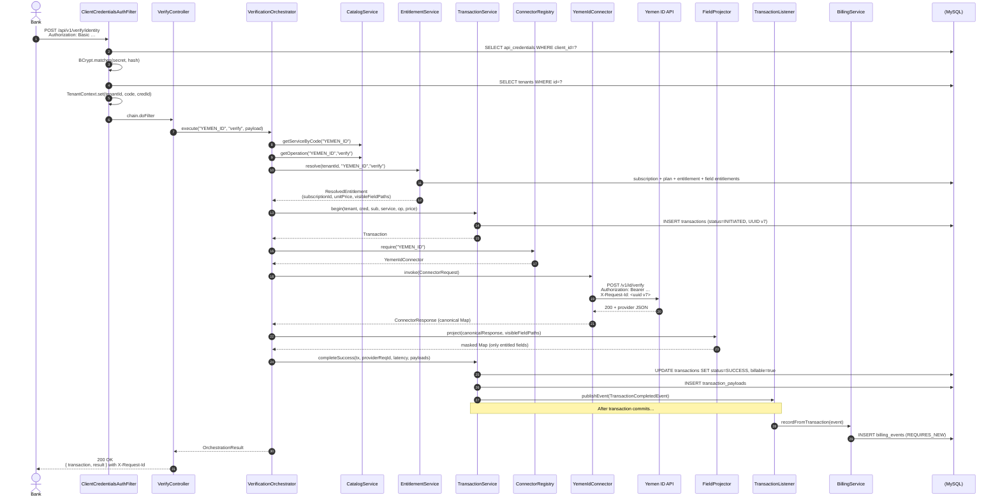

# Sannad — System Architecture

> **Sannad** is a multi-tenant identity verification platform that brokers calls between banks/fintechs (service providers) and national identity backends (Yemen ID, etc.). One unified REST surface, plan-driven access control, per-transaction billing.

## Table of contents

- [1. High-level view](#1-high-level-view)
- [2. Tech stack](#2-tech-stack)
- [3. Module map](#3-module-map)
- [4. Modules in detail](#4-modules-in-detail)
  - [4.1 Common](#41-common-platformcommon)
  - [4.2 IAM](#42-iam-platformiam)
  - [4.3 Catalog](#43-catalog-platformcatalog)
  - [4.4 Subscription / Entitlements](#44-subscription--entitlements-platformsubscription)
  - [4.5 Connector SPI](#45-connector-spi-platformconnector)
  - [4.6 Gateway](#46-gateway-platformgateway)
  - [4.7 Transactions](#47-transactions-platformtransactions)
  - [4.8 Billing](#48-billing-platformbilling)
- [5. Request flow — verify identity](#5-request-flow--verify-identity)
- [6. Field-level masking ("hit-only vs full data")](#6-field-level-masking-hit-only-vs-full-data)
- [7. Adding a new backend connector](#7-adding-a-new-backend-connector)
- [8. Cross-cutting concerns](#8-cross-cutting-concerns)
- [9. Admin portal (frontend)](#9-admin-portal-frontend)
- [10. Configuration profiles](#10-configuration-profiles)

---

## 1. High-level view



**Two distinct API surfaces**, both served by the same Spring Boot application:

| Surface | Path | Auth | Audience |
|---|---|---|---|
| **Service Provider API** | `/api/v1/**` | HTTP Basic (`clientId:clientSecret`) | Banks integrating with Sannad |
| **Admin Portal API** | `/admin/**` | Bearer JWT (from `/admin/auth/login`) | Platform operators using the React portal |

---

## 2. Tech stack

| Layer | Choice | Why |
|---|---|---|
| Language | **Java 21** (compiles to bytecode 21, runs on JDK 21+) | LTS, modern records, pattern matching |
| Framework | **Spring Boot 3.4.x** | First-class Jakarta EE 10, latest Hibernate 6, auto-config |
| Database | **MySQL 8.4** | Customer requirement (`yemen` schema, `root/12345678` in dev) |
| Migrations | **Flyway 10** + `flyway-mysql` | SQL-first, tracked, plus CLI plugin (`mvnw flyway:*`) |
| ORM | **Hibernate 6.6** via Spring Data JPA | UUID stored as `CHAR(36)` via `hibernate.type.preferred_uuid_jdbc_type=CHAR` |
| Security | **Spring Security 6.4** + **JJWT 0.12** | Two custom filters: client-credentials (Basic) and JWT |
| HTTP client | **Spring `WebClient`** (Reactor Netty) | Non-blocking calls to backend providers |
| Resilience | **Resilience4j 2.2** | Circuit breaker + retry on Yemen ID connector |
| ID generation | **uuid-creator 5.3** | UUID v7 (time-ordered) for transaction ids |
| API docs | **springdoc-openapi 2.7** | Two grouped specs: `/api-docs/service-provider` + `/api-docs/admin`, Swagger UI at `/swagger-ui.html` |
| Build | **Maven 3.9** via Maven Wrapper | `./mvnw` — no system Maven needed |
| Frontend | **Vite 6 + React 18 + TS + Tailwind 3** | The React admin portal in [portal-admin/](../portal-admin/) |

---

## 3. Module map

The backend is a **modular monolith** — one deployable, hard package boundaries that we can extract into microservices later if any single module justifies it.

```
src/main/java/com/middleware/platform/
├── PlatformApplication.java         · entry point
├── common/                          · errors, request id, tenant context, utils
├── iam/                             · tenants, credentials, admin users, security
├── catalog/                         · service / operation / field registry
├── subscription/                    · plans, entitlements, resolver
├── connector/
│   ├── spi/                         · VerificationConnector SPI + registry
│   └── yemenid/                     · Yemen ID v0.1.0 implementation
├── gateway/                         · orchestrator, field projector, /api/v1/...
├── transactions/                    · hot+cold transaction store, domain events
├── billing/                         · billing event capture (event listener)
└── config/                          · WebClient + cross-cutting beans
```

**Dependency direction (one-way, no cycles):**

```
common  ←  iam  ←  catalog  ←  subscription  ←  gateway
                      ↑                            ↑
                      └────  connector/spi  ←──────┘
                                ↑                  ↑
                                └─ yemenid       transactions ← billing
```

The gateway is the "hub" — it composes all the other modules. Connectors only depend on the SPI. Billing only depends on transactions' published events.

---

## 4. Modules in detail

### 4.1 Common — `platform.common`

Cross-cutting plumbing used by every other module.

| File | Role |
|---|---|
| [`error/ErrorCode.java`](../src/main/java/com/middleware/platform/common/error/ErrorCode.java) | Enum of every numeric error code (1001 = `BAD_REQUEST`, 1202 = `ENTITLEMENT_DENIED`, 2101 = `CONNECTOR_ERROR`, …). Each carries an HTTP status. |
| [`error/ApplicationException.java`](../src/main/java/com/middleware/platform/common/error/ApplicationException.java) | Single exception type the rest of the codebase throws. Carries an `ErrorCode`. Static factories: `notFound`, `conflict`, `forbidden`. |
| [`error/ApiError.java`](../src/main/java/com/middleware/platform/common/error/ApiError.java) | Canonical JSON error envelope: `timestamp`, `errorCode`, `error`, `message`, `requestId`, `fieldErrors[]`. |
| [`error/GlobalExceptionHandler.java`](../src/main/java/com/middleware/platform/common/error/GlobalExceptionHandler.java) | `@RestControllerAdvice` mapping `ApplicationException`, validation, auth/access-denied, and any unhandled `Exception` to the `ApiError` envelope with the right HTTP status + `X-Error-Code` / `X-Error-Msg` / `X-Request-Id` headers. |
| [`tenant/TenantContext.java`](../src/main/java/com/middleware/platform/common/tenant/TenantContext.java) | `ThreadLocal<TenantInfo>` populated by the client-credentials filter and read by services downstream. |
| [`util/Ids.java`](../src/main/java/com/middleware/platform/common/util/Ids.java) | Helpers: `uuidV7()` (time-ordered), `newClientId()` / `newClientSecret()` (random url-safe). |
| [`web/RequestIdFilter.java`](../src/main/java/com/middleware/platform/common/web/RequestIdFilter.java) | Highest-precedence servlet filter — assigns a UUID v7 `X-Request-Id` to every inbound request, stores it in MDC for log correlation, returns it as a response header. |

### 4.2 IAM — `platform.iam`

The smallest possible "identity and access" module — no Keycloak, no SSO, just enough for the two real use-cases: bank-to-API authentication and admin-portal login.

**Domain entities** ([`iam/domain/`](../src/main/java/com/middleware/platform/iam/domain/)):

| Entity | Table | Purpose |
|---|---|---|
| `Tenant` | `tenants` | A bank or service provider. Has a code, legal name, status (`PENDING`/`ACTIVE`/`SUSPENDED`/`TERMINATED`). |
| `ApiCredential` | `api_credentials` | A `clientId` / BCrypt-hashed `clientSecret` pair issued to a tenant. The plaintext secret is shown **once** at issuance and is never retrievable. Has IP allowlist and expiration. |
| `AdminUser` | `admin_users` | Platform staff user. Email + BCrypt password + role (`SUPER_ADMIN`, `PLATFORM_OPS`, `FINANCE`, `AUDITOR`). |

**Security** ([`iam/security/`](../src/main/java/com/middleware/platform/iam/security/)):

| Component | Role |
|---|---|
| [`SecurityConfig.java`](../src/main/java/com/middleware/platform/iam/security/SecurityConfig.java) | Wires the security filter chain. Public: actuator health, swagger, `POST /admin/auth/login`. `/admin/**` requires admin role. `/api/**` requires `ROLE_TENANT`. Stateless sessions. Returns 401 on auth failure. |
| [`ClientCredentialsAuthFilter.java`](../src/main/java/com/middleware/platform/iam/security/ClientCredentialsAuthFilter.java) | Runs only on `/api/**`. Parses HTTP Basic, looks up `ApiCredential` by `client_id`, BCrypt-checks the secret, loads the `Tenant`, populates Spring Security context AND `TenantContext`. |
| [`JwtAuthFilter.java`](../src/main/java/com/middleware/platform/iam/security/JwtAuthFilter.java) | Runs only on `/admin/**` (except `/admin/auth/login`). Parses Bearer JWT, populates Spring Security context with the admin role. |
| [`JwtService.java`](../src/main/java/com/middleware/platform/iam/security/JwtService.java) | Issues + parses HMAC-signed JWTs. Min secret length 256 bits. Configurable issuer + TTL. |

**Bootstrap admin** — on first startup, [`AdminUserService.seedBootstrapAdmin()`](../src/main/java/com/middleware/platform/iam/service/AdminUserService.java) creates the dev admin (`admin@middleware.local` / `admin123`) if it doesn't exist. Disabled in `prod` profile.

### 4.3 Catalog — `platform.catalog`

The dictionary of "what can be called and what can come back". Drives the gateway's routing and the entitlement engine's allow-list of fields.

| Entity | Table | Purpose |
|---|---|---|
| `ServiceDefinition` | `service_definitions` | A backend provider — e.g. `YEMEN_ID`. Has a `connector_key` that must match a registered `VerificationConnector` bean. |
| `ServiceOperation` | `service_operations` | An operation on a service — e.g. `verify`. Carries a default unit price + currency. |
| `FieldDefinition` | `field_definitions` | Every dot-path the canonical response can return for an operation — e.g. `verification.status`, `person.demographics.names.arabic.first`. **This is the universe of fields the entitlement engine can grant.** |

The catalog is **append-only via Flyway migrations**. To add a new field path, write a new migration; do not insert at runtime. This ensures every plan entitlement references a fixed schema.

### 4.4 Subscription / Entitlements — `platform.subscription`

The commercial layer. Decides what each tenant can call, how much it costs, and what they're allowed to see in the response.

| Entity | Table | Purpose |
|---|---|---|
| `Plan` | `plans` | A commercial tier — e.g. `YEMEN_ID_BASIC` (hit-only) or `YEMEN_ID_PREMIUM` (full data). Has a base fee + currency. |
| `PlanEntitlement` | `plan_entitlements` | Per-operation grant on a plan: which operation is allowed, with optional unit-price override, monthly quota, and rate limit. |
| `PlanFieldEntitlement` | `plan_field_entitlements` | Per-field grant on a plan: which response paths the plan unlocks. **This drives the field-level masking feature.** |
| `Subscription` | `subscriptions` | Binds a tenant to a plan with a date window. The active subscription is the one resolved at request time. |

**The single point the gateway consults** is [`EntitlementService.resolve(tenantId, serviceCode, operationCode)`](../src/main/java/com/middleware/platform/subscription/service/EntitlementService.java) which returns a `ResolvedEntitlement` with:
- `subscriptionId`, `planId`, `operationId`
- `unitPriceMinor` + `currency` (for billing)
- `monthlyQuota`, `rateLimitPerMinute`
- **`visibleFieldPaths`** — the `Set<String>` consumed by the `FieldProjector`

If no active subscription exists, or the plan doesn't include the operation, this throws `ENTITLEMENT_DENIED` and the gateway records a `REJECTED` transaction.

### 4.5 Connector SPI — `platform.connector`

The pluggable extension point for adding new backend providers.

**SPI** ([`connector/spi/`](../src/main/java/com/middleware/platform/connector/spi/)):

```java
public interface VerificationConnector {
    String key();                                  // matches service_definitions.connector_key
    ConnectorResponse invoke(ConnectorRequest req);
}
```

| Class | Role |
|---|---|
| `ConnectorRequest` | Carries `operationCode`, `tenantId`, `requestId` (UUID v7), the canonical payload as `Map<String, Object>`, and free-form metadata. |
| `ConnectorResponse` | `providerHttpStatus`, `providerRequestId`, `payload` (the canonical response Map), `latencyMs`. |
| `ConnectorRegistry` | `@Component` that auto-discovers all `VerificationConnector` beans on startup and looks them up by `key()`. Adding a new provider = drop in a new `@Component`. |

**Yemen ID implementation** ([`connector/yemenid/`](../src/main/java/com/middleware/platform/connector/yemenid/)):

| Class | Role |
|---|---|
| [`YemenIdConnector.java`](../src/main/java/com/middleware/platform/connector/yemenid/YemenIdConnector.java) | Implements the SPI. Calls `POST /v1/id/verify` on the configured base URL with bearer-token auth. Wrapped in `@CircuitBreaker(name="yemen-id")` and `@Retry(name="yemen-id")`. Translates the canonical request Map to/from a typed `YemenIdVerifyRequest` / `YemenIdVerifyResponse`. |
| [`YemenIdProperties.java`](../src/main/java/com/middleware/platform/connector/yemenid/YemenIdProperties.java) | `@ConfigurationProperties(prefix="platform.connectors.yemen-id")` — base URL, bearer token, timeout. Bound from `application-{profile}.yml`. |

### 4.6 Gateway — `platform.gateway`

The request orchestration layer — composes catalog, subscription, connectors, transactions, and field projection into one synchronous flow per bank call.

| Class | Role |
|---|---|
| [`api/VerifyController.java`](../src/main/java/com/middleware/platform/gateway/api/VerifyController.java) | `@RestController` exposing `POST /api/v1/verify/identity`. Validates the canonical `VerifyIdentityRequest`, builds a `Map` payload, hands it to the orchestrator. |
| [`orchestrator/VerificationOrchestrator.java`](../src/main/java/com/middleware/platform/gateway/orchestrator/VerificationOrchestrator.java) | The single function `execute(serviceCode, operationCode, payload)` that runs the entire verification flow (see [§5](#5-request-flow--verify-identity)). |
| [`projection/FieldProjector.java`](../src/main/java/com/middleware/platform/gateway/projection/FieldProjector.java) | The **field-level masking engine**. Takes a canonical response Map + a `Set<String>` of allowed paths, returns a new Map containing only the entitled fields. Supports nested objects and arrays of objects. See [§6](#6-field-level-masking-hit-only-vs-full-data). |
| `dto/` | `VerifyIdentityRequest`, `VerifyIdentityResponse` — bank-facing canonical DTOs (independent of any specific backend provider). |

### 4.7 Transactions — `platform.transactions`

Audit-grade record of every call routed through the platform — successful, failed, or rejected.

| Entity | Table | Purpose |
|---|---|---|
| `Transaction` | `transactions` | Hot row: id (UUID v7), tenant, credential, subscription, service, operation, status (`INITIATED`/`SUCCESS`/`FAILED`/`TIMEOUT`/`REJECTED`), latency, error code/message, unit price + currency, billable flag, created_at. Indexed by `(tenant_id, created_at)`. |
| `TransactionPayload` | `transaction_payloads` | Cold storage: tenant request JSON, tenant (projected) response JSON, provider request JSON, provider response JSON. Stored as `LONGTEXT`. Separated from the hot row so audit data can have its own retention/encryption policy. |

**Domain event** — [`TransactionCompletedEvent`](../src/main/java/com/middleware/platform/transactions/event/TransactionCompletedEvent.java) is published from `TransactionService.completeSuccess` / `completeFailed` via Spring's `ApplicationEventPublisher`. Today: in-process. Future: outbox + Kafka.

### 4.8 Billing — `platform.billing`

The metering layer. Ingests `TransactionCompletedEvent` and writes one `BillingEvent` per successful billable transaction.

| Entity | Table | Purpose |
|---|---|---|
| `BillingEvent` | `billing_events` | One row per billable transaction. Carries unit price, amount (= unit price for v1), currency, period (`YYYY-MM`), occurred_at. **Unique on `transaction_id`** so re-publishing the same event is idempotent. |

| Component | Role |
|---|---|
| [`listener/TransactionListener.java`](../src/main/java/com/middleware/platform/billing/listener/TransactionListener.java) | `@TransactionalEventListener(phase = AFTER_COMMIT, fallbackExecution = true)` — fires after the originating transaction commits, then calls `BillingService.recordFromTransaction` in a brand-new transaction. |
| [`service/BillingService.java`](../src/main/java/com/middleware/platform/billing/service/BillingService.java) | `@Transactional(propagation = REQUIRES_NEW)` — critical: without `REQUIRES_NEW` the persist gets attached to a phantom synchronization in the AFTER_COMMIT phase and silently never flushes. We learned this the hard way. |

**Aggregation** — `BillingService.summarize(tenantId, period)` runs a JPQL group-by that returns one `PeriodSummary` (totalAmountMinor + transactionCount) per currency. Cron-driven invoice generation hangs off this.

---

## 5. Request flow — verify identity



**Key invariants:**

1. **Every call produces a `transactions` row** — even rejected ones (entitlement denial) get a `REJECTED` row with no billing event. Even failures get a `FAILED` row with `billable=false`. Auditors can see everything.
2. **The provider response is persisted in full** in `transaction_payloads`, then **masked before being returned** to the bank. The audit log always has the complete data; the bank only sees what they paid for.
3. **Billing fires AFTER COMMIT** so a billing failure can never roll back a verification.
4. **`X-Request-Id` is generated per-request** by [`RequestIdFilter`](../src/main/java/com/middleware/platform/common/web/RequestIdFilter.java), forwarded to the backend, written to MDC for log correlation, and used as the platform transaction id.

---

## 6. Field-level masking ("hit-only vs full data")

The headline product feature. The same backend response, the same code path, the same connector — but two different bank tenants on two different plans get two completely different response shapes.

### How it works

1. The catalog declares **every possible field** that an operation can return as a row in `field_definitions`. Example for `YEMEN_ID/verify`:
   - `transaction.id`, `transaction.timestamp`
   - `verification.status`, `verification.biometric.status`, `verification.biometric.score`
   - `person.nationalNumber`, `person.demographics`, `person.cards`

2. Each plan declares **which fields it grants** as rows in `plan_field_entitlements`. Example:
   - `YEMEN_ID_BASIC` grants only the `transaction.*` and `verification.*` paths.
   - `YEMEN_ID_PREMIUM` grants those PLUS `person.nationalNumber`, `person.demographics`, `person.cards`.

3. At request time, [`EntitlementService.resolve`](../src/main/java/com/middleware/platform/subscription/service/EntitlementService.java) loads the active subscription's plan and returns a `Set<String>` of granted paths.

4. The orchestrator builds the **full canonical response** from the connector and passes it through [`FieldProjector.project(response, allowedPaths)`](../src/main/java/com/middleware/platform/gateway/projection/FieldProjector.java).

### The projection rule

A path `P` in the source response is included in the output **iff** there exists an entitled path `E` such that `P == E` OR `P` starts with `E + "."`. This means:

- Granting `verification` includes the entire `verification.*` subtree.
- Granting `verification.status` includes only that one leaf — `verification.biometric.score` is hidden.
- Granting `person.demographics` includes the entire demographics subtree without listing every leaf.

For arrays of objects (e.g. `person.cards[]`), the rule is applied **per element**, with no array index in the path. So granting `person.cards.documentNumber` exposes the `documentNumber` field of every card in the array.

### Why this is a big deal

- **No code changes** to add a new pricing tier. Just insert rows into `plan_field_entitlements`.
- **No conditional logic** in the connector. The connector always fetches everything; masking is done at the gateway.
- **The audit log is always complete** — we masked the *response*, not the *transaction record*.
- **A bank's response shape is deterministic** for the lifetime of their subscription, even as we add new fields to the canonical schema.

---

## 7. Adding a new backend connector

To onboard a new identity backend (e.g. passport authority):

1. **Implement the SPI** — write a new `@Component` class implementing `VerificationConnector` with a unique `key()` (e.g. `"PASSPORT_YEMEN"`). Use `WebClient` + `@CircuitBreaker` + `@Retry` for resilience. Translate the canonical request `Map` to/from the provider-native payload.

2. **Register in the catalog** — write a Flyway migration that:
   - Inserts a row into `service_definitions` with the new `connector_key`.
   - Inserts one or more rows into `service_operations` (e.g. `lookup`, `verify`).
   - Inserts rows into `field_definitions` for every dot-path the new operations can return.

3. **Wire a verify endpoint** (optional) — if it should be exposed on a new bank-facing path, add a new method in `VerifyController` (or a new controller) that calls `orchestrator.execute("PASSPORT_YEMEN", "verify", payload)`.

4. **Grant it to plans** — for each plan that should include the new service, insert rows into `plan_entitlements` (operation grant) and `plan_field_entitlements` (field grants).

That's it. **No changes** to the gateway, the field projector, transactions, billing, security, or the admin portal — they all read from the catalog at runtime.

---

## 8. Cross-cutting concerns

### Logging & request correlation

- **`X-Request-Id`** (UUID v7) is generated per inbound request by [`RequestIdFilter`](../src/main/java/com/middleware/platform/common/web/RequestIdFilter.java), pushed into SLF4J `MDC`, propagated to the backend connector, and echoed back to the bank.
- Every log line in the request thread carries the `requestId` field.
- The platform's transaction ID is the same UUID as `X-Request-Id` — one ID, end to end.

### Resilience

- [`@CircuitBreaker(name="yemen-id")`](../src/main/java/com/middleware/platform/connector/yemenid/YemenIdConnector.java) — opens after 50% failure rate over a 20-call sliding window. Open for 30 s. 3 trial calls in half-open state.
- `@Retry(name="yemen-id")` — 3 attempts with 500 ms backoff, only on `IOException` and `TimeoutException`.
- `WebClient` itself has a 15 s read/write timeout and a 5 s connect timeout (configured in [`WebClientConfig`](../src/main/java/com/middleware/platform/config/WebClientConfig.java)).

### Error handling

- **All exceptions** thrown anywhere in the stack are caught by [`GlobalExceptionHandler`](../src/main/java/com/middleware/platform/common/error/GlobalExceptionHandler.java), translated to the canonical `ApiError` envelope, and tagged with `X-Error-Code` / `X-Error-Msg` / `X-Request-Id` headers. Banks always get a structured error.
- Internal codes are 4-digit numbers (1xxx = client errors, 2xxx = server errors) — see [`ErrorCode.java`](../src/main/java/com/middleware/platform/common/error/ErrorCode.java).

### Security

- Two filters in the chain, gated by URL prefix:
  - `/api/**` → `ClientCredentialsAuthFilter` (HTTP Basic + BCrypt against `api_credentials`)
  - `/admin/**` → `JwtAuthFilter` (Bearer JWT issued by `JwtService`)
- Stateless sessions everywhere.
- CORS handled by Vite proxy in dev (no Spring CORS config), needs explicit config in prod if the portal is on a different origin.
- Secrets (BCrypt hashes, JWT signing key) live in the active profile's YAML; **prod profile refuses to start** unless `PLATFORM_SECURITY_JWT_SECRET` is set as an environment variable.

### Observability hooks

- Spring Boot Actuator exposes `/actuator/health`, `/actuator/info`, `/actuator/prometheus`.
- Resilience4j metrics flow through Micrometer to the same endpoint.
- Hibernate SQL logging is at `DEBUG` in dev (very useful for tracing the entitlement queries) and silenced in staging/prod.

---

## 9. Admin portal (frontend)

A separate Vite + React + TypeScript + Tailwind app in [portal-admin/](../portal-admin/) that talks **only** to the `/admin/**` API surface via a Vite dev proxy on `localhost:8080`.

| Concern | Implementation |
|---|---|
| Routing | `react-router-dom` v6, protected routes via `ProtectedRoute` |
| State (server) | `@tanstack/react-query` v5 — keys per resource, 30 s stale time |
| State (client) | `zustand` with `persist` middleware — auth + theme + lang |
| HTTP | `axios` with a single shared instance + JWT interceptor + 401 handler |
| Forms | `react-hook-form` + `zod` |
| UI | Custom components on top of `@headlessui/react` (Dialog, Listbox, Menu) |
| Icons | `lucide-react` |
| Charts | `recharts` |
| i18n | `i18next` + `react-i18next` (English + Arabic, full RTL via logical Tailwind classes + Cairo font) |
| Theme | CSS variables driven by `:root` / `:root.dark`, no `dark:` variants in components |

**11 pages, 13 reusable UI components, 7 API modules, 1 unified prefs store.** See [portal-admin/](../portal-admin/).

---

## 10. Configuration profiles

Five YAML files in [src/main/resources/](../src/main/resources/):

| File | Purpose | Notable defaults |
|---|---|---|
| `application.yml` | Base — JPA, Flyway, server, actuator, springdoc, Resilience4j, Hibernate UUID = CHAR. **Default active profile: `dev`** | `spring.profiles.active=${SPRING_PROFILES_ACTIVE:dev}` |
| `application-dev.yml` | Local laptop | MySQL `localhost:3306` (root/12345678), bootstrap admin enabled, debug logging |
| `application-test.yml` | `./mvnw test` runs | Separate `yemen_test` schema, env-overridable via `TEST_DB_URL` |
| `application-staging.yml` | Pre-production | All secrets via env vars (`${VAR:?…}` placeholders refuse to start if missing) |
| `application-prod.yml` | Production | Strictest — larger Hikari pool, hidden errors/stack traces, restricted actuator, JWT TTL 30 min, bootstrap admin hard-disabled |

Activate via `SPRING_PROFILES_ACTIVE=prod`, `-Dspring.profiles.active=prod`, or `./mvnw spring-boot:run -Dspring-boot.run.profiles=staging`.

---

## See also

- [DATABASE.md](DATABASE.md) — full schema reference, ERD diagram, every column.
- [README.md](../README.md) — how to run locally.
- [postman/README.md](../postman/README.md) — Postman collection for banks.
- [yemen_id_0_1_0.yaml](../yemen_id_0_1_0.yaml) — the upstream Yemen ID OpenAPI spec we wrap.
