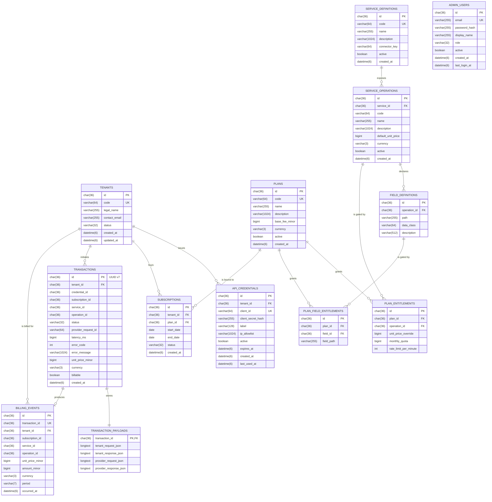

# Sannad — Database Schema

> MySQL 8.4 · schema name `yemen` · all tables InnoDB / `utf8mb4_unicode_ci` · all UUID columns stored as `CHAR(36)` (Hibernate `preferred_uuid_jdbc_type=CHAR`).

## Table of contents

- [1. Conventions](#1-conventions)
- [2. ERD](#2-erd)
- [3. Migration order](#3-migration-order)
- [4. Tables](#4-tables)
  - [4.1 IAM](#41-iam-v1__core_iamsql)
    - [`tenants`](#tenants)
    - [`api_credentials`](#api_credentials)
    - [`admin_users`](#admin_users)
  - [4.2 Service Catalog](#42-service-catalog-v2__catalogsql)
    - [`service_definitions`](#service_definitions)
    - [`service_operations`](#service_operations)
    - [`field_definitions`](#field_definitions)
  - [4.3 Plans & Subscriptions](#43-plans--subscriptions-v3__subscriptionsql)
    - [`plans`](#plans)
    - [`plan_entitlements`](#plan_entitlements)
    - [`plan_field_entitlements`](#plan_field_entitlements)
    - [`subscriptions`](#subscriptions)
  - [4.4 Transactions](#44-transactions-v4__transactionssql)
    - [`transactions`](#transactions)
    - [`transaction_payloads`](#transaction_payloads)
  - [4.5 Billing](#45-billing-v5__billingsql)
    - [`billing_events`](#billing_events)
- [5. Seed data](#5-seed-data-v6__seed_yemen_id_catalogsql)
- [6. Index summary](#6-index-summary)
- [7. Foreign-key cascade matrix](#7-foreign-key-cascade-matrix)
- [8. Operational notes](#8-operational-notes)

---

## 1. Conventions

| Pattern | Choice |
|---|---|
| **Primary keys** | `id varchar(36) NOT NULL PRIMARY KEY` — UUID stored as 36-char string. `transactions.id` is a UUID v7 (time-ordered) generated by `Ids.uuidV7()`; all other IDs are UUID v4 generated by Hibernate's `@UuidGenerator`. |
| **Timestamps** | `datetime(6)` (microsecond precision). All times stored as UTC; the JPA layer uses `Instant`. |
| **Booleans** | `boolean` (MySQL alias for `tinyint(1)`). |
| **Money** | `bigint` minor units (cents). The currency lives in a sibling `varchar(3)` column. **Never** floating point. |
| **Periods** | `varchar(7)` in `YYYY-MM` form (e.g. `2026-04`). Computed from `occurred_at` in UTC. |
| **JSON blobs** | `longtext` (up to 4 GB) — used in `transaction_payloads` for the encrypted-at-rest payloads. Per-app encryption is a TODO; today they're plaintext for dev. |
| **String IDs** | `varchar(64)` for human-readable codes (`tenants.code`, `service_definitions.code`, `plans.code`). Always uppercase + underscores by convention (e.g. `BANK_DEMO`, `YEMEN_ID_BASIC`). |
| **Foreign keys** | Explicit `CONSTRAINT fk_xxx` with `ON DELETE` declared per relationship — never inline `REFERENCES`. |
| **Enums** | Stored as `varchar(32)` with the Java enum name as the value. No native MySQL `ENUM` types — easier to evolve. |
| **Naming** | `snake_case` columns, `snake_case` tables, `singular for entity, plural for table` (e.g. entity `Tenant` → table `tenants`). |

---

## 2. ERD



---

## 3. Migration order

Flyway runs the migrations in `src/main/resources/db/migration/` in lexical order:

| File | Creates |
|---|---|
| [`V1__core_iam.sql`](../src/main/resources/db/migration/V1__core_iam.sql) | `tenants`, `api_credentials`, `admin_users` |
| [`V2__catalog.sql`](../src/main/resources/db/migration/V2__catalog.sql) | `service_definitions`, `service_operations`, `field_definitions` |
| [`V3__subscription.sql`](../src/main/resources/db/migration/V3__subscription.sql) | `plans`, `plan_entitlements`, `plan_field_entitlements`, `subscriptions` |
| [`V4__transactions.sql`](../src/main/resources/db/migration/V4__transactions.sql) | `transactions`, `transaction_payloads` |
| [`V5__billing.sql`](../src/main/resources/db/migration/V5__billing.sql) | `billing_events` |
| [`V6__seed_yemen_id_catalog.sql`](../src/main/resources/db/migration/V6__seed_yemen_id_catalog.sql) | Seed: 1 service, 1 operation, 8 fields, 2 plans, 2 operation entitlements, 13 field entitlements |

Run `./mvnw flyway:info` to see what's pending vs applied.

---

## 4. Tables

### 4.1 IAM (`V1__core_iam.sql`)

#### `tenants`

A bank or service provider on the platform.

| Column | Type | Constraints | Notes |
|---|---|---|---|
| `id` | `varchar(36)` | **PK** | UUID v4 generated by Hibernate `@UuidGenerator`. |
| `code` | `varchar(64)` | **UK** `uk_tenants_code`, NOT NULL | Human-readable identifier — `BANK_DEMO`, `BANK_ALPHA`. Uppercase + underscores. |
| `legal_name` | `varchar(255)` | NOT NULL | Full legal name (e.g. "Demo Bank Ltd"). |
| `contact_email` | `varchar(255)` | nullable | Primary integration contact. |
| `status` | `varchar(32)` | NOT NULL | Java enum `TenantStatus`: `PENDING` / `ACTIVE` / `SUSPENDED` / `TERMINATED`. |
| `created_at` | `datetime(6)` | NOT NULL | UTC. Set on insert. |
| `updated_at` | `datetime(6)` | NOT NULL | UTC. Touched on every update via `@PreUpdate`. |

**Lifecycle:** `PENDING` (just onboarded) → `ACTIVE` (live) → optionally `SUSPENDED` (paused) → `TERMINATED` (off-boarded). Terminated tenants are kept for audit; we never `DELETE`.

---

#### `api_credentials`

Machine-to-machine credentials issued to a tenant.

| Column | Type | Constraints | Notes |
|---|---|---|---|
| `id` | `varchar(36)` | **PK** | |
| `tenant_id` | `varchar(36)` | **FK** → `tenants(id)` ON DELETE CASCADE, NOT NULL | A credential cannot outlive its tenant. |
| `client_id` | `varchar(64)` | **UK** `uk_credentials_client_id`, NOT NULL | Public identifier. Format: `cli_<base64url-12bytes>`. |
| `client_secret_hash` | `varchar(255)` | NOT NULL | **BCrypt hash**, never the plaintext. The plaintext (`sec_<base64url-32bytes>`) is shown to the user **once** at creation and never persisted. |
| `label` | `varchar(128)` | nullable | Human label (e.g. `"Production"` or `"smoke-test"`). |
| `ip_allowlist` | `varchar(1024)` | nullable | Comma-separated CIDRs. **Enforcement is a TODO** in the security filter; the column exists ahead of time. |
| `active` | `boolean` | NOT NULL DEFAULT TRUE | Soft revocation. |
| `expires_at` | `datetime(6)` | nullable | If set and in the past, auth fails. |
| `created_at` | `datetime(6)` | NOT NULL | |
| `last_used_at` | `datetime(6)` | nullable | Touched on successful authentication (TODO — not yet wired). |

**Indexes:**
- `uk_credentials_client_id` (UNIQUE) — primary lookup path during HTTP Basic auth.
- `idx_api_credentials_tenant` — list credentials per tenant.

---

#### `admin_users`

Platform staff users who log in to the admin portal.

| Column | Type | Constraints | Notes |
|---|---|---|---|
| `id` | `varchar(36)` | **PK** | |
| `email` | `varchar(255)` | **UK** `uk_admin_users_email`, NOT NULL | Login identifier. |
| `password_hash` | `varchar(255)` | NOT NULL | BCrypt hash. |
| `display_name` | `varchar(255)` | nullable | Shown in the UI. |
| `role` | `varchar(32)` | NOT NULL | `SUPER_ADMIN` / `PLATFORM_OPS` / `FINANCE` / `AUDITOR`. Used in `@PreAuthorize` and React route guards. |
| `active` | `boolean` | NOT NULL DEFAULT TRUE | |
| `created_at` | `datetime(6)` | NOT NULL | |
| `last_login_at` | `datetime(6)` | nullable | Touched on successful login. |

**Bootstrap admin:** in dev/test profiles, `AdminUserService.seedBootstrapAdmin()` inserts `admin@middleware.local` / `admin123` (BCrypt-hashed) on first start. Disabled in `prod`.

---

### 4.2 Service Catalog (`V2__catalog.sql`)

#### `service_definitions`

A backend identity provider — e.g. Yemen ID, future passport authority.

| Column | Type | Constraints | Notes |
|---|---|---|---|
| `id` | `varchar(36)` | **PK** | |
| `code` | `varchar(64)` | **UK** `uk_service_definitions_code`, NOT NULL | Stable code referenced by `connector_key` lookups (e.g. `YEMEN_ID`). |
| `name` | `varchar(255)` | NOT NULL | Human-friendly name. |
| `description` | `varchar(1024)` | nullable | |
| `connector_key` | `varchar(64)` | NOT NULL | **Must match** the `key()` returned by a registered `VerificationConnector` bean. The orchestrator uses this to look the connector up at runtime. |
| `active` | `boolean` | NOT NULL DEFAULT TRUE | If false, all calls to operations on this service are rejected. |
| `created_at` | `datetime(6)` | NOT NULL | |

---

#### `service_operations`

An operation exposed by a service — e.g. `verify`, `lookup`.

| Column | Type | Constraints | Notes |
|---|---|---|---|
| `id` | `varchar(36)` | **PK** | |
| `service_id` | `varchar(36)` | **FK** → `service_definitions(id)` ON DELETE CASCADE, NOT NULL | |
| `code` | `varchar(64)` | NOT NULL | Operation code (e.g. `verify`). |
| `name` | `varchar(255)` | NOT NULL | |
| `description` | `varchar(1024)` | nullable | |
| `default_unit_price` | `bigint` | NOT NULL | Default per-call price in **minor units**. A plan can override via `plan_entitlements.unit_price_override`. |
| `currency` | `varchar(3)` | NOT NULL | ISO 4217 (e.g. `USD`). |
| `active` | `boolean` | NOT NULL DEFAULT TRUE | |
| `created_at` | `datetime(6)` | NOT NULL | |

**Constraints:**
- `uk_op_service_code` UNIQUE on `(service_id, code)` — no two operations on the same service share a code.
- Index `idx_op_service` on `service_id`.

---

#### `field_definitions`

The dictionary of every dot-path the canonical response can return for an operation. This is the universe from which `plan_field_entitlements` selects.

| Column | Type | Constraints | Notes |
|---|---|---|---|
| `id` | `varchar(36)` | **PK** | |
| `operation_id` | `varchar(36)` | **FK** → `service_operations(id)` ON DELETE CASCADE, NOT NULL | |
| `path` | `varchar(255)` | NOT NULL | Dot-separated path against the canonical response — `verification.status`, `person.demographics.names.arabic.first`. |
| `data_class` | `varchar(64)` | nullable | Hint: `string`, `number`, `boolean`, `object`, `array`. Used by the catalog UI; not enforced at runtime. |
| `description` | `varchar(512)` | nullable | |

**Constraints:**
- `uk_field_op_path` UNIQUE on `(operation_id, path)` — each path is registered exactly once per operation.
- Index `idx_field_operation` on `operation_id`.

> **Discipline:** these rows are append-only via Flyway migrations. Never insert at runtime — every plan entitlement and every projection rule expects the catalog to be a frozen schema.

---

### 4.3 Plans & Subscriptions (`V3__subscription.sql`)

#### `plans`

A commercial subscription tier.

| Column | Type | Constraints | Notes |
|---|---|---|---|
| `id` | `varchar(36)` | **PK** | |
| `code` | `varchar(64)` | **UK** `uk_plans_code`, NOT NULL | E.g. `YEMEN_ID_BASIC`, `YEMEN_ID_PREMIUM`. |
| `name` | `varchar(255)` | NOT NULL | Display name. |
| `description` | `varchar(1024)` | nullable | Sales description. |
| `base_fee_minor` | `bigint` | NOT NULL DEFAULT 0 | Recurring base subscription fee in minor units (e.g. 0 = pure pay-as-you-go). |
| `currency` | `varchar(3)` | NOT NULL | |
| `active` | `boolean` | NOT NULL DEFAULT TRUE | Inactive plans cannot be subscribed to. |
| `created_at` | `datetime(6)` | NOT NULL | |

---

#### `plan_entitlements`

Per-operation grant on a plan: which operation is allowed, with optional pricing override and quota.

| Column | Type | Constraints | Notes |
|---|---|---|---|
| `id` | `varchar(36)` | **PK** | |
| `plan_id` | `varchar(36)` | **FK** → `plans(id)` ON DELETE CASCADE, NOT NULL | |
| `operation_id` | `varchar(36)` | **FK** → `service_operations(id)` ON DELETE CASCADE, NOT NULL | |
| `unit_price_override` | `bigint` | nullable | If set, overrides `service_operations.default_unit_price`. Same currency as the operation. |
| `monthly_quota` | `bigint` | nullable | Max billable calls per calendar month. `NULL` = unlimited. **Enforcement is TODO** — column exists ahead of time. |
| `rate_limit_per_minute` | `int` | nullable | Per-credential burst limit. `NULL` = unlimited. **Enforcement is TODO**. |

**Constraints:**
- `uk_plan_entitlement` UNIQUE on `(plan_id, operation_id)` — at most one row per plan/operation pair.
- Index `idx_plan_entitlement_plan` on `plan_id`.

---

#### `plan_field_entitlements`

**The "hit-only vs full-data" feature lives here.** Per-field grant on a plan: which response paths the plan unlocks.

| Column | Type | Constraints | Notes |
|---|---|---|---|
| `id` | `varchar(36)` | **PK** | |
| `plan_id` | `varchar(36)` | **FK** → `plans(id)` ON DELETE CASCADE, NOT NULL | |
| `field_id` | `varchar(36)` | **FK** → `field_definitions(id)` ON DELETE CASCADE, NOT NULL | |
| `field_path` | `varchar(255)` | NOT NULL | Cached copy of `field_definitions.path` so the entitlement resolver doesn't need to JOIN at request time. Kept in sync at insert time. |

**Constraints:**
- `uk_plan_field_entitlement` UNIQUE on `(plan_id, field_id)` — a path is granted at most once per plan.
- Index `idx_plan_field_entitlement_plan` on `plan_id`.

The set of `field_path` values for a plan, returned by `EntitlementService.resolve`, is the `Set<String>` consumed by `FieldProjector.project`.

---

#### `subscriptions`

Binds a tenant to a plan with a date window.

| Column | Type | Constraints | Notes |
|---|---|---|---|
| `id` | `varchar(36)` | **PK** | |
| `tenant_id` | `varchar(36)` | **FK** → `tenants(id)` ON DELETE CASCADE, NOT NULL | |
| `plan_id` | `varchar(36)` | **FK** → `plans(id)` (no cascade — restrict), NOT NULL | A plan with active subscriptions cannot be deleted. |
| `start_date` | `date` | NOT NULL | Day the subscription becomes effective. |
| `end_date` | `date` | nullable | If set, the subscription expires at end-of-day. `NULL` = open-ended. |
| `status` | `varchar(32)` | NOT NULL | `PENDING` / `ACTIVE` / `SUSPENDED` / `CANCELED` / `EXPIRED`. |
| `created_at` | `datetime(6)` | NOT NULL | |

**Indexes:** `idx_subscription_tenant` on `tenant_id`, `idx_subscription_status` on `status`.

**The active subscription** for a tenant is found via:

```sql
SELECT * FROM subscriptions
 WHERE tenant_id = ? AND status = 'ACTIVE'
 ORDER BY start_date DESC LIMIT 1
```

with an additional date-window check in Java (`startDate <= today AND (endDate IS NULL OR endDate >= today)`).

---

### 4.4 Transactions (`V4__transactions.sql`)

#### `transactions`

The hot row written for **every** call routed through the platform — successful, failed, timed out, or rejected.

| Column | Type | Constraints | Notes |
|---|---|---|---|
| `id` | `varchar(36)` | **PK** | **UUID v7** — time-ordered, generated by `Ids.uuidV7()`. Same value as the `X-Request-Id` header. |
| `tenant_id` | `varchar(36)` | **FK** → `tenants(id)` (no cascade — restrict), NOT NULL | |
| `credential_id` | `varchar(36)` | NOT NULL | The `api_credentials.id` that authenticated the call. Not a hard FK so credentials can be rotated/deleted without losing audit history. |
| `subscription_id` | `varchar(36)` | nullable | Active subscription at the time. NULL only if the request was rejected before entitlement resolution (very rare). |
| `service_id` | `varchar(36)` | NOT NULL | The `service_definitions.id` that handled the call. Not a hard FK for the same audit reason. |
| `operation_id` | `varchar(36)` | NOT NULL | The `service_operations.id`. |
| `status` | `varchar(32)` | NOT NULL | `INITIATED` / `SUCCESS` / `FAILED` / `TIMEOUT` / `REJECTED`. |
| `provider_request_id` | `varchar(64)` | nullable | The transaction id returned by the upstream backend (when available). |
| `latency_ms` | `bigint` | nullable | Wall-clock time spent inside the connector (set on success only). |
| `error_code` | `int` | nullable | `ErrorCode.code()` value when status is not `SUCCESS`. |
| `error_message` | `varchar(1024)` | nullable | Truncated error message. |
| `unit_price_minor` | `bigint` | nullable | The price quoted at request time (frozen at the moment the transaction was initiated, even if the plan changes later). |
| `currency` | `varchar(3)` | nullable | |
| `billable` | `boolean` | NOT NULL DEFAULT FALSE | True only on successful completion. Drives the billing event listener. |
| `created_at` | `datetime(6)` | NOT NULL | When the transaction was initiated. |

**Indexes:**
- `idx_tx_tenant_created` on `(tenant_id, created_at)` — primary query path for the admin "transactions by tenant" view.
- `idx_tx_subscription` on `subscription_id` — usage analytics per subscription.
- `idx_tx_operation` on `operation_id` — operation-level analytics.

> **Partitioning** is recommended for high-volume tenants. Add monthly partitions on `created_at` once the table grows past tens of millions of rows.

---

#### `transaction_payloads`

Cold storage for the request and response payloads. One row per transaction.

| Column | Type | Constraints | Notes |
|---|---|---|---|
| `transaction_id` | `varchar(36)` | **PK** + **FK** → `transactions(id)` ON DELETE CASCADE | One-to-one with `transactions`. |
| `tenant_request_json` | `longtext` | nullable | The bank's request body (canonical, after validation). |
| `tenant_response_json` | `longtext` | nullable | The **projected/masked** response we sent back to the bank. |
| `provider_request_json` | `longtext` | nullable | The provider-native request the connector built. |
| `provider_response_json` | `longtext` | nullable | The **full** provider response, before masking. **The audit trail is always complete here**, even if the bank only saw a hit-only result. |

**Why a separate table:** keeps the `transactions` index small, allows independent retention/encryption/purge policies, and lets us drop a 4 GB blob column from a hot query without rewriting the whole row.

> **TODO before production:** encrypt the `*_json` columns with KMS-issued data keys (AES-GCM). Especially relevant for any biometric `image` payloads in `provider_request_json`.

---

### 4.5 Billing (`V5__billing.sql`)

#### `billing_events`

One row per **successful billable transaction**. Aggregates roll up into invoices.

| Column | Type | Constraints | Notes |
|---|---|---|---|
| `id` | `varchar(36)` | **PK** | |
| `transaction_id` | `varchar(36)` | **UK** `uk_billing_transaction`, NOT NULL | Idempotency key — re-processing the same `TransactionCompletedEvent` is a no-op. Not a hard FK to `transactions` for the same audit reason as above. |
| `tenant_id` | `varchar(36)` | **FK** → `tenants(id)` (restrict), NOT NULL | |
| `subscription_id` | `varchar(36)` | NOT NULL | The subscription the transaction was billed against. |
| `service_id` | `varchar(36)` | NOT NULL | |
| `operation_id` | `varchar(36)` | NOT NULL | |
| `unit_price_minor` | `bigint` | NOT NULL | The unit price at the moment of the transaction. |
| `amount_minor` | `bigint` | NOT NULL | For v1, always equals `unit_price_minor` (one billable unit per call). The column exists separately so future tiered/volume pricing can write a different value. |
| `currency` | `varchar(3)` | NOT NULL | |
| `period` | `varchar(7)` | NOT NULL | `YYYY-MM` derived from `occurred_at` in UTC. The aggregation key for monthly invoices. |
| `occurred_at` | `datetime(6)` | NOT NULL | When the transaction completed. |

**Indexes:**
- `uk_billing_transaction` UNIQUE on `transaction_id` — idempotency.
- `idx_billing_tenant_period` on `(tenant_id, period)` — primary query path for monthly invoicing.

**Aggregation query** (used by `BillingService.summarize`):

```sql
SELECT tenant_id, period, currency,
       SUM(amount_minor) AS total_amount_minor,
       COUNT(*)         AS transaction_count
  FROM billing_events
 WHERE tenant_id = ? AND period = ?
 GROUP BY tenant_id, period, currency;
```

---

## 5. Seed data (`V6__seed_yemen_id_catalog.sql`)

The seed migration inserts the Yemen ID service catalog and two reference plans so the platform is fully usable on first start.

| Insert | Rows | What |
|---|---|---|
| `service_definitions` | 1 | `YEMEN_ID` (connector key `YEMEN_ID`) |
| `service_operations` | 1 | `verify` (default unit price 50 minor USD) |
| `field_definitions` | 8 | All response paths: `transaction.id`, `transaction.timestamp`, `verification.status`, `verification.biometric.status`, `verification.biometric.score`, `person.nationalNumber`, `person.demographics`, `person.cards` |
| `plans` | 2 | `YEMEN_ID_BASIC` (hit-only) + `YEMEN_ID_PREMIUM` (full data) |
| `plan_entitlements` | 2 | Both plans get the `verify` operation. BASIC: 30 minor USD, 10 000 quota, 60 rpm. PREMIUM: 150 minor USD, 50 000 quota, 600 rpm. |
| `plan_field_entitlements` | 13 | BASIC unlocks the 5 `transaction.*` and `verification.*` paths. PREMIUM unlocks those PLUS `person.nationalNumber`, `person.demographics`, `person.cards`. |

The seed UUIDs are deterministic (`11111111-1111-…`, `22222222-…`, etc.) so tests and docs can reference them by hand.

---

## 6. Index summary

| Table | Index | Type | Columns | Purpose |
|---|---|---|---|---|
| `tenants` | `uk_tenants_code` | UNIQUE | `code` | Lookup tenant by human-readable code |
| `api_credentials` | `uk_credentials_client_id` | UNIQUE | `client_id` | Hot path: HTTP Basic auth lookup |
| `api_credentials` | `idx_api_credentials_tenant` | secondary | `tenant_id` | "List my credentials" |
| `admin_users` | `uk_admin_users_email` | UNIQUE | `email` | Login lookup |
| `service_definitions` | `uk_service_definitions_code` | UNIQUE | `code` | Catalog lookup by code |
| `service_operations` | `uk_op_service_code` | UNIQUE | `service_id, code` | Catalog lookup by `(service, op)` |
| `service_operations` | `idx_op_service` | secondary | `service_id` | "List operations for a service" |
| `field_definitions` | `uk_field_op_path` | UNIQUE | `operation_id, path` | Catalog dictionary uniqueness |
| `field_definitions` | `idx_field_operation` | secondary | `operation_id` | "List fields for an operation" |
| `plans` | `uk_plans_code` | UNIQUE | `code` | Plan lookup by code |
| `plan_entitlements` | `uk_plan_entitlement` | UNIQUE | `plan_id, operation_id` | One entitlement per plan/op |
| `plan_entitlements` | `idx_plan_entitlement_plan` | secondary | `plan_id` | "List my plan's operations" |
| `plan_field_entitlements` | `uk_plan_field_entitlement` | UNIQUE | `plan_id, field_id` | One field grant per plan/field |
| `plan_field_entitlements` | `idx_plan_field_entitlement_plan` | secondary | `plan_id` | Hot path: load all visible paths for a plan |
| `subscriptions` | `idx_subscription_tenant` | secondary | `tenant_id` | "Active subscriptions for tenant" |
| `subscriptions` | `idx_subscription_status` | secondary | `status` | Status sweeps (e.g. expire job) |
| `transactions` | `idx_tx_tenant_created` | secondary | `tenant_id, created_at` | Admin transactions table |
| `transactions` | `idx_tx_subscription` | secondary | `subscription_id` | Per-subscription analytics |
| `transactions` | `idx_tx_operation` | secondary | `operation_id` | Per-operation analytics |
| `billing_events` | `uk_billing_transaction` | UNIQUE | `transaction_id` | Idempotency on event re-processing |
| `billing_events` | `idx_billing_tenant_period` | secondary | `tenant_id, period` | Monthly invoice aggregation |

---

## 7. Foreign-key cascade matrix

| Parent | Child | ON DELETE |
|---|---|---|
| `tenants` | `api_credentials` | `CASCADE` (terminating a tenant tears down their credentials) |
| `tenants` | `subscriptions` | `CASCADE` |
| `tenants` | `transactions` | `RESTRICT` — cannot delete a tenant with audit history |
| `tenants` | `billing_events` | `RESTRICT` — same reason |
| `service_definitions` | `service_operations` | `CASCADE` |
| `service_operations` | `field_definitions` | `CASCADE` |
| `service_operations` | `plan_entitlements` | `CASCADE` |
| `field_definitions` | `plan_field_entitlements` | `CASCADE` |
| `plans` | `plan_entitlements` | `CASCADE` |
| `plans` | `plan_field_entitlements` | `CASCADE` |
| `plans` | `subscriptions` | `RESTRICT` — cannot delete a plan with bound subscriptions |
| `transactions` | `transaction_payloads` | `CASCADE` (purging an old transaction purges its blobs) |

**Soft FKs (no DB-level constraint, deliberately):** `transactions.credential_id`, `transactions.service_id`, `transactions.operation_id`, `billing_events.subscription_id` / `service_id` / `operation_id` / `transaction_id`. These reference rows that may be deleted/rotated over time, but the audit log must keep the reference forever. Application code preserves them.

---

## 8. Operational notes

### Backup priorities

| Tier | Tables | RPO target |
|---|---|---|
| **Critical (hot)** | `tenants`, `api_credentials`, `admin_users`, `plans`, `plan_entitlements`, `plan_field_entitlements`, `subscriptions`, `service_definitions`, `service_operations`, `field_definitions` | ~5 minutes |
| **Critical (warm)** | `transactions`, `billing_events` | ~5 minutes — auditor will ask |
| **Bulk (cold)** | `transaction_payloads` | hours OK; can rebuild from upstream + transactions if lost |

### Retention recommendations

| Table | Suggested retention | Reason |
|---|---|---|
| `transactions` | 7 years | Banking audit |
| `transaction_payloads` | 90 days for biometric blobs, 7 years for non-PII | Privacy + storage cost balance |
| `billing_events` | 7 years | Tax / audit |
| `admin_users.last_login_at` activity | indefinite | Security audit |

### Performance to watch

- **`transactions` size** — at ~10M rows the table-scan tail of any unindexed query becomes painful. Add monthly partitioning (`PARTITION BY RANGE (TO_DAYS(created_at))`) before that.
- **`plan_field_entitlements` JOIN** — `EntitlementService.resolve` issues a single `SELECT … WHERE plan_id = ?` per request. Cache the result per `(planId, version)` in Redis if you start to see it in the hot path.
- **`HikariCP` max pool** — dev = 20, staging = 30, prod = 50. Tune up only after observing connection wait times in Micrometer.

### Schema evolution

- **Always Flyway-only.** Never modify the schema by hand in any environment that has been deployed to. The Maven plugin (`./mvnw flyway:info` / `flyway:migrate`) is your friend; the Flyway Spring Boot integration auto-applies on app start.
- **Never edit a migration that has been applied to any environment.** Fix forward — write a `Vn+1__fix.sql`.
- **Naming:** `Vn__snake_case_description.sql` (double underscore is required by Flyway).
- **Seed data lives in numbered migrations** too — keep dev data deterministic by reusing the seed UUIDs from `V6__seed_yemen_id_catalog.sql`.

---

## See also

- [ARCHITECTURE.md](ARCHITECTURE.md) — system components, request flows, module map.
- [README.md](../README.md) — how to run locally.
- [src/main/resources/db/migration/](../src/main/resources/db/migration/) — the source of truth for the schema.
